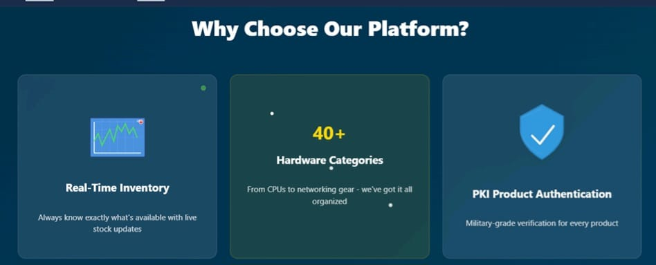

client/public/WhatsApp Image 2026-01-01 at 8.37.36 PM.jpeg
# 🛒 TechWare — IT Components Marketplace

TechWare is a **full-stack IT components e-commerce marketplace** built using the **PERN stack**. It enables verified sellers to list authentic hardware products and allows users to securely browse, purchase, and manage IT components across multiple categories.

> Built with scalability, security, and real-world e-commerce workflows in mind.

---

## 🚀 Features

- 🧩 Multi-category IT hardware marketplace (20+ products)
- 🔐 PKI-based authentication for verified sellers
- 💳 Secure payment integration with PayFast
- ☁️ Media management using Cloudinary
- 📦 Automated order confirmation
- ⚡ Scalable backend with Supabase

---

## 🛠️ Tech Stack

**Frontend**
- React.js
- TypeScript
- Material-UI / Shadcn UI

**Backend**
- Node.js
- Express.js
- PostgreSQL

**Services & Tools**
- Supabase (Auth & DB)
- Cloudinary (Image Storage)
- PayFast (Payments)
- Git & GitHub

---

## 📸 Screenshots

### 🏠 Homepage

### 🛍️ Inventory Management

### 🔐 Authentication

### 💳 Checkout & Payments

---

